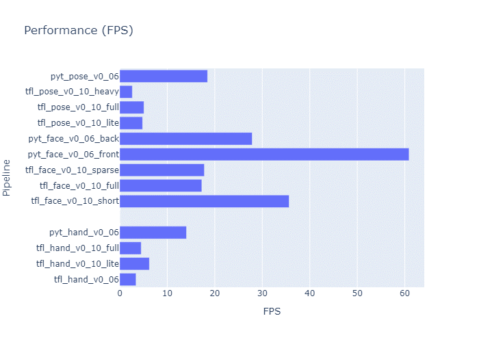

# Overview

Python demonstration code for mediapipe models (blazepalm/hand, blazeface, blazepose).

## Instructions

Perform the following steps to execute on your platform, using tflite as example.

Replace "tflite" with other targets when applicable.

1. Clone repository

    $ git clone https://github.com/AlbertaBeef/blaze_app_python

    $ cd blaze_app_python

2. Select target

    $ cd tflite

3. Download models

    $ cd models
   
    $ source ./get_tflite_models.sh
   
    $ cd ..

5. Launch Application

    For hand landmarks :

    $ python3 blaze_detect_live.py --blaze hand

    Replace "hand" with "face" for face landmarks, or "pose" for body landmarks.

### Launch Arguments

| -Argument | --Argument    | Description                               | 
| :-------: | :-----------: | :---------------------------------------- | 
|  -h       | --help        | show this help message and exit |
|  -i       | --input       | Video input device. Default is auto-detect (first usbcam) |
|  -I       | --testimage   | Use test image as input (womand_hands.jpg). Default is usbcam  |
|  -b       | --blaze       | Command seperated list of applications  (hand, face, pose).  Default is 'hand, face, pose'      |
|  -t       | --target      | Command seperated list of targets (blaze_tflite, blaze_pytorch, blaze_vitisai).  Default is 'blaze_tflite,blaze_pytorch,blaze_vitisai,blaze_hailo'      |
|  -p       | --pipeline    | Command seperated list of pipelines (Use --list to get list of targets). Default is 'all'  |
|  -l       | --list        | List pipelines                            |
|  -d       | --debug       | Enable Debug Mode.  Default is off        |
|  -w       | --withoutview | Disable Output Viewing.  Default is on    |
|  -z       | --profilelog  | Enable Profile Log Mode.  Default is off  |
|  -Z       | --profileview | Enable Profile View Mode.  Default is off |
|  -f       | --fps         | Enable FPS Display.  Default is off       |

### Run-Time Options

| Key | Description                               | 
| :-: | :---------------------------------------- | 
|  p  | pause video ...                           |
|  c  | continue ...                              |
|  s  | step one frame at a time ...              |
|  w  | take a photo ...                          |
|  t  | toggle between test image and live video  |
|  h  | toggle horizontal mirror on input         |
|  a  | toggle detection overlay on/off           |
|  b  | toggle roi overlay on/off                 |
|  l  | toggle landmarks overlay on/off           |
|  d  | toggle debug image on/off                 |
|  e  | toggle scores image on/off                |
|  f  | toggle FPS display on/off                 |
|  v  | toggle verbose on/off                     |
|  z  | toggle profile log on/off                 |
|  y  | toggle profile view on/off                |
   

## Supported Frameworks

The blaze_app_python demo provides a common code base for comparing models inferenced from the following frameworks:
- TFLite : [google/mediapipe](https://github.com/google/mediapipe/blob/master/docs/solutions/models.md)
- PyTorch : [zmurez/MediaPipePytorch](https://github.com/zmurez/MediaPipePyTorch)
- Vitis-AI 3.5 : [AlbertaBeef/blaze_tutorial/vitis-ai](https://github.com/AlbertaBeef/blaze_tutorial/tree/2023.1/vitis-ai)
- Hailo-8 : [AlbertaBeef/blaze_tutorial/hailo-8](https://github.com/AlbertaBeef/blaze_tutorial/tree/2023.1/hailo-8)
- MemryX MX3 : [AlbertaBeef/blaze_tutorial/memryx](https://github.com/AlbertaBeef/blaze_tutorial/tree/mx3/memryx)

## Supported Models

The following specific models are supported.

 
<b>TFLite models</b>

Detection Models

| Version | Model                    | Input Size  |  Scores   |   Boxes   | Comments             | Source               | Model Link                                | 
| :-----: | :----------------------: | :---------: | :-------: | :-------: | :------------------- | :------------------- | :---------------------------------------- | 
|  v0.07  | Palm                     |   256\*256  |   2944    |  2944x18  | BBox + 7 keypoints   | [metalwhale/hand_tracking](https://.github.com/metalwhale/hand_tracking) | [palm_detection_without_custom_op.tflite](https://raw.githubusercontent.com/metalwhale/hand_tracking/master/models/palm_detection_without_custom_op.tflite)  |
|  v0.10  | Palm (Lite)              |   192\*192  |   2016    |  2016x18  | BBox + 7 keypoints   | [google/mediapipe](https://github.com/google/mediapipe/blob/master/docs/solutions/models.md) | [palm_detection_full.tflite](https://storage.googleapis.com/mediapipe-assets/palm_detection_lite.tflite) | 
|  v0.10  | Palm (Full)              |   192\*192  |   2016    |  2016x18  | BBox + 7 keypoints   | [google/mediapipe](https://github.com/google/mediapipe/blob/master/docs/solutions/models.md) | [palm_detection_full.tflite](https://storage.googleapis.com/mediapipe-assets/palm_detection_full.tflite) | 
|  v0.07  | Face (Front Camera)      |   256\*256  |    896    |   896x16   | BBox + 6 keypoints  | [google/mediapipe/v0.7.11](https://github.com/google/mediapipe/v0.7.11) | [face_detection_front.tflite](https://raw.githubusercontent.com/google/mediapipe/v0.7.11/mediapipe/models/face_detection_front.tflite)  |
|  v0.07  | Face (Back Camera)       |   256\*256  |    896    |   896x16   | BBox + 6 keypoints  | [google/mediapipe/v0.7.11](https://github.com/google/mediapipe/v0.7.11) | [face_detection_back.tflite](https://raw.githubusercontent.com/google/mediapipe/v0.7.11/mediapipe/models/face_detection_back.tflite)  |
|  v0.10  | Face (Short Range)       |   128\*128  |    896    |   896x16  | BBox + 6 keypoints   | [google/mediapipe](https://github.com/google/mediapipe/blob/master/docs/solutions/models.md) | [face_detection_short_range.tflite](https://storage.googleapis.com/mediapipe-assets/face_detection_short_range.tflite) | 
|  v0.10  | Face (Full Range)        |   128\*128  |    896    |   896x16  | BBox + 6 keypoints   | [mgoogle/mediapipe](https://github.com/google/mediapipe/blob/master/docs/solutions/models.md) | [face_detection_full_range.tflite](https://storage.googleapis.com/mediapipe-assets/face_detection_full_range.tflite) | 
|  v0.10  | Face (Full Range Sparse) |   128\*128  |    896    |   896x16  | BBox + 6 keypoints   | [google/mediapipe](https://github.com/google/mediapipe/blob/master/docs/solutions/models.md) | [face_detection_full_range_sparse.tflite](https://storage.googleapis.com/mediapipe-assets/face_detection_full_range_sparse.tflite) | 
|  v0.07  | Pose                     |   128\*128  |    896    |   896x12  | BBox + 4 keypoints   |  | [pose_detection_v0_07.tflite]([)](https://avtinc.sharepoint.com/:u:/t/ET-Downloads/EQ_OekMvLOhKtg8423P_NhMBdG3L8dbZdEqrDN5ZeHRYHw?e=2m6jMm) |
|  v0.10  | Pose                     |   224\*224  |   2254    |  2254x12  | BBox + 4 keypoints   | [google/mediapipe](https://github.com/google/mediapipe/blob/master/docs/solutions/models.md) | [pose_detection.tflite](https://storage.googleapis.com/mediapipe-assets/pose_detection.tflite) | 

Landmarks Models

| Version | Model        | Input Size  |  Flag  | Landmarks | Comments                                 | Source               | Model Link                                | 
| :-----: | :----------: | :---------: | :----: | :-------: | :--------------------------------------- | :------------------- | :---------------------------------------- | 
|  v0.07  | Hand         |   256\*256  |    1   |    21x3   | 21 keypoints (x,y,score)                 | [google/mediapipe/v0.7.11](https://github.com/google/mediapipe/v0.7.11) | [hand_landmark.tflite](https://raw.githubusercontent.com/google/mediapipe/v0.7.11/mediapipe/models/hand_landmark.tflite)  |
|  v0.10  | Hand (Lite)  |   224\*224  |    1   |  2016x18  | 21 keypoints (x,y,score)                 | [google/mediapipe](https://github.com/google/mediapipe/blob/master/docs/solutions/models.md) | [hand_landmark_lite.tflite](https://storage.googleapis.com/mediapipe-assets/hand_landmark_lite.tflite) | 
|  v0.10  | Hand (Full)  |   224\*224  |    1   |  2016x18  | 21 keypoints (x,y,score)                 | [google/mediapipe](https://github.com/google/mediapipe/blob/master/docs/solutions/models.md)| [hand_landmark_full.tflite](https://storage.googleapis.com/mediapipe-assets/hand_landmark_full.tflite) | 
|  v0.07  | Face         |   256\*256  |    1   |   896x16   | 468 keypoints (x,y,score)               | [google/mediapipe/v0.7.11](https://github.com/google/mediapipe/v0.7.11) | [face_landmark.tflite](https://raw.githubusercontent.com/google/mediapipe/v0.7.11/mediapipe/models/hand_landmark.tflite)  |
|  v0.10  | Face         |   192\*192  |    1   |   896x16  | 468 keypoints (x,y,score)                | [google/mediapipe](https://github.com/google/mediapipe/blob/master/docs/solutions/models.md) | [face_landmark.tflite](https://storage.googleapis.com/mediapipe-assets/face_landmark.tflite) | 
|  v0.10  | Pose (Full Body, Lite)  |   256\*256  |    1   |    39x5   | 39 keypoints (x,y,z,visibility,presence) | [google/mediapipe](https://github.com/google/mediapipe/blob/master/docs/solutions/models.md) | [pose_landmark_lite.tflite](https://storage.googleapis.com/mediapipe-assets/pose_landmark_lite.tflite) | 
|  v0.07  | Pose (Upper Body) |   256\*256  |    1   |    39x5   | 31 keypoints (x,y,z,visibility,presence) |  | [pose_landmark_v0_07_upper_body.tflite]([https://raw.githubusercontent.com/zmurez/MediaPipePyTorch/master/blazepose_landmark.pth](https://avtinc.sharepoint.com/:u:/t/ET-Downloads/Ecp0ghv20vZJl2Xo2ijuTN0BmYheTPs0yPWxQKnzck7K9w?e=T0XsyU))| 
|  v0.10  | Pose (Full Body, Full)  |   256\*256  |    1   |    39x5   | 39 keypoints (x,y,z,visibility,presence) | [google/mediapipe](https://github.com/google/mediapipe/blob/master/docs/solutions/models.md) | [pose_landmark_full.tflite](https://storage.googleapis.com/mediapipe-assets/pose_landmark_full.tflite) | 
|  v0.10  | Pose (Full Body, Heavy) |   256\*256  |    1   |    39x5   | 39 keypoints (x,y,z,visibility,presence) | [google/mediapipe](https://github.com/google/mediapipe/blob/master/docs/solutions/models.md) | [pose_landmark_heavy.tflite](https://storage.googleapis.com/mediapipe-assets/pose_landmark_heavy.tflite) | 

 
<b>PyTorch models</b>

Detection Models

| Version | Type                | Input Size  |  Scores   |   Boxes   | Comments             | Source               | Model Link                                | 
| :-----: | :-----------------: | :---------: | :-------: | :-------: | :------------------- | :------------------- | :---------------------------------------- | 
|  v0.07  | Palm                |   256\*256  |   2944    |  2944x18  | BBox + 7 keypoints   | [zmurez/MediaPipePytorch](https://github.com/zmurez/MediaPipePyTorch) | [blazepalm.pth](https://raw.githubusercontent.com/zmurez/MediaPipePyTorch/master/blazepalm.pth)  |
|  v0.07  | Face (Front Camera) |   128\*128  |    896    |   896x16  | BBox + 6 keypoints   | [zmurez/MediaPipePytorch](https://github.com/zmurez/MediaPipePyTorch) | [blazeface.pth](https://raw.githubusercontent.com/zmurez/MediaPipePyTorch/master/blazeface.pth) | 
|  v0.07  | Face (Back Camera)  |   256\*256  |    896    |   896x16  | BBox + 6 keypoints   | [zmurez/MediaPipePytorch](https://github.com/zmurez/MediaPipePyTorch) | [blazefaceback.pth](https://raw.githubusercontent.com/zmurez/MediaPipePyTorch/master/blazefaceback.pth) | 
|  v0.07  | Pose                |   128\*128  |    896    |   896x12  | BBox + 4 keypoints   | [zmurez/MediaPipePytorch](https://github.com/zmurez/MediaPipePyTorch) | [blazepose.pth](https://raw.githubusercontent.com/zmurez/MediaPipePyTorch/master/blazepose.pth) | 

Landmarks Models

| Version | Type              | Input Size  |  Flag  | Landmarks  | Comments             | Source               | Model Link                                | 
| :-----: | :---------------: | :---------: | :----: | :-------: | :------------------- | :------------------- | :---------------------------------------- | 
|  v0.07  | Hand              |   256\*256  |    1   |    21x3  | 21 keypoints (x,y,score)  | [zmurez/MediaPipePytorch](https://github.com/zmurez/MediaPipePyTorch) | [blazehand_landmark.pth](https://raw.githubusercontent.com/zmurez/MediaPipePyTorch/master/blazehand_landmark.pth) |
|  v0.07  | Face              |   192\*192  |    1   |   896x16  | 468 keypoints (x,y,score)   | [zmurez/MediaPipePytorch](https://github.com/zmurez/MediaPipePyTorch) | [blazeface_landmark.pth](https://raw.githubusercontent.com/zmurez/MediaPipePyTorch/master/blazeface_landmark.pth) | 
|  v0.07  | Pose (Upper Body) |   256\*256  |    1   |    39x5   | 31 keypoints (x,y,z,visibility,presence) | [zmurez/MediaPipePytorch](https://github.com/zmurez/MediaPipePyTorch) | [blazepose_landmark.pth](https://raw.githubusercontent.com/zmurez/MediaPipePyTorch/master/blazepose_landmark.pth)| 

## Profiling

Profiling Results for the following pipelines on various platforms

| Type    | Pipeline              | Detector Model                                              | Landmark Model                                                        | 
| :-----: | :-------------------: | :---------------------------------------------------------- | :-------------------------------------------------------------------- | 
|  hand   | tfl_hand_v0_07        | blaze_tflite/models/palm_detection_without_custom_op.tflite | blaze_tflite/models/hand_landmark_v0_07.tflite                        |
|  hand   | tfl_hand_v0_10_lite   | blaze_tflite/models/palm_detection_lite.tflite              | blaze_tflite/models/hand_landmark_lite.tflite                         |
|  hand   | tfl_hand_v0_10_full   | blaze_tflite/models/palm_detection_full.tflite              | blaze_tflite/models/hand_landmark_full.tflite                         |
|  hand   | pyt_hand_v0_07        | blaze_pytorch/models/blazepalm.pth                          | blaze_pytorch/models/blazehand_landmark.pth                           |
|  hand   | vai_hand_v0_07        | blaze_vitisai/models/blazepalm/{DPU}/blazepalm.xmodel       | blaze_vitisai/models/blazehandlandmark/{DPU}/blazehandlandmark.xmodel |
|  hand   | hai_hand_v0_07        | blaze_hailo/models/palm_detection_v0_07.hef                 | blaze_hailo/models/hand_landmark_v0_07.hef                            |
|  hand   | hai_hand_v0_10_lite   | blaze_hailo/models/palm_detection_lite.hef                  | blaze_hailo/models/hand_landmark_lite.hef                             |
|  hand   | hai_hand_v0_10_full   | blaze_hailo/models/palm_detection_full.hef                  | blaze_hailo/models/hand_landmark_full.hef                             |
|  face   | tfl_face_front_v0_07  | blaze_tflite/models/face_detection_front_v0_07.tflite       | blaze_tflite/models/face_landmark_v0_07.tflite                        |
|  face   | tfl_face_back_v0_07   | blaze_tflite/models/face_detection_back_v0_07.tflite        | blaze_tflite/models/face_landmark_v0_07.tflite                        |
|  face   | tfl_face_v0_10_short  | blaze_tflite/models/face_detection_short_range.tflite       | blaze_tflite/models/face_landmark.tflite                              |
|  face   | tfl_face_v0_10_full   | blaze_tflite/models/face_detection_full_range.tflite        | blaze_tflite/models/face_landmark.tflite                              |
|  face   | tfl_face_v0_10_sparse | blaze_tflite/models/face_detection_full_range_sparse.tflite | blaze_tflite/models/face_landmark.tflite                              |
|  face   | pyt_face_v0_07_front  | blaze_pytorch/models/blazeface.pth                          | blaze_pytorch/models/blazeface_landmark.pth                           |
|  face   | pyt_face_v0_07_back   | blaze_pytorch/models/blazefaceback.pth                      | blaze_pytorch/models/blazeface_landmark.pth                           |
|  face   | hai_face_v0_10_short  | blaze_hailo/models/face_detection_short_range.hef           | blaze_hailo/models/face_landmark.hef                                  |
|  face   | hai_face_v0_10_full   | blaze_hailo/models/face_detection_full_range.hef            | blaze_hailo/models/face_landmark.hef                                  |
|  pose   | tfl_pose_v0_10_lite   | blaze_tflite/models/pose_detection.tflite                   | blaze_tflite/models/pose_landmark_lite.tflite                         |
|  pose   | tfl_pose_v0_10_full   | blaze_tflite/models/pose_detection.tflite                   | blaze_tflite/models/pose_landmark_full.tflite                         |
|  pose   | tfl_pose_v0_10_heavy  | blaze_tflite/models/pose_detection.tflite                   | blaze_tflite/models/pose_landmark_heavy.tflite                        |
|  pose   | tfl_pose_v0_07_upper  | blaze_tflite/models/pose_detection_v0_07.tflite             | blaze_tflite/models/pose_landmark_v0_07_upper_body.tflite             |
|  pose   | tflq_pose_v0_07_upper | blaze_tflite_quant/models/pose_detection_128x128_full_integer_quant.tflite | blaze_tflite_quant/models/pose_landmark_upper_body_256x256_full_integer_quant.tflite |
|  pose   | tflh_pose_v0_07_upper | blaze_tflite/models/pose_detection_v0_07.tflite             | blaze_tflite_quant/models/pose_landmark_upper_body_256x256_full_integer_quant.tflite |
|  pose   | tflq_pose_v0_10_upper | blaze_tflite_quant/models/pose_detection_full_quant.tflite  | blaze_tflite_quant/models/pose_landmark_full_quant.tflite             |
|  pose   | pyt_pose_v0_07        | blaze_pytorch/models/blazepose.pth                          | blaze_pytorch/models/blazepose_landmark.pth                           |
|  pose   | hai_pose_v0_10_lite   | blaze_tflite/models/pose_detection.tflite                   | blaze_hailo/models/pose_landmark_lite.hef                             |

Where {DPU} corresponds to the DPU architecture for Vitis-AI targets.

 
<b>Workstation (HP Z4 G4) with AMD Radeon Pro W7900 GPU</b>

Latency

Frame Rate (estimated from total latency)

 
<b>Laptop (ZBook)</b>

Latency

Frame Rate (estimated from total latency)

 
<b>ZUBoard with B512 DPU</b>

Latency

Frame Rate (estimated from total latency)

## References

The blaze_app_python demo is based on the following work:
   - Google MediaPipe models : [google/mediapipe](https://github.com/google/mediapipe/blob/master/docs/solutions/models.md)
   - BlazePalm : [vidursatija/BlazePalm](https://github.com/vidursatija/BlazePalm)
   - BlazeFace-PyTorch : [hollance/BlazeFace-PyTorch](https://github.com/hollance/BlazeFace-PyTorch)
   - MediaPipePyTorch : [zmurez/MediaPipePytorch](https://github.com/zmurez/MediaPipePyTorch)
   - Blaze Tutorial : [AlbertaBeef/blaze_tutorial](https://github.com/AlbertaBeef/blaze_tutorial/tree/2023.1)

The following articles provide detailed information on Accelerating MediaPipe:
   - Hackster Series Part 1 [Blazing Fast Models](https://avnet.me/mediapipe-01-models)
   - Hackster Series Part 2 [Insightful Datasets for ASL recognition](https://avnet.me/mediapipe-02-datasets)
   - Hackster Series Part 3 [Accelerating the MediaPipe models with Vitis-AI 3.5](https://avnet.me/mediapipe-03-vitis-ai-3.5)
   - Hackster Series Part 4 [Accelerating the MediaPipe models with Hailo-8](https://avnet.me/mediapipe-04-Hailo-8)
   - Hackster Series Part 5 [Accelerating the MediaPipe models on RPI5 AI Kit](https://avnet.me/mediapipe-05-rpi5aikit)
   - Hackster Series Part 6 [Accelerating the MediaPipe models with MemryX](https://avnet.me/mediapipe-06-memryx)
   - Blaze Utility (python version) : [blaze_app_python](https://github.com/albertabeef/blaze_app_python)
   - Blaze Utility (C++ version) : [blaze_app_cpp](https://github.com/albertabeef/blaze_app_cpp)
